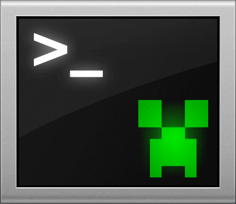

<div align="center">



# Minecraft Console Client 2.0 (MCC)

[Documentation](docs/index.md) | [Download](#download) | [Installation](docs/getting-started/installation.md) | [Configuration](docs/client/configuration.md) | [Usage](docs/getting-started/first-session.md)

[](https://github.com/MCCTeam/Minecraft-Console-Client/actions/workflows/mcc.yml)
[](https://discord.gg/sfBv4TtpC9)
[](LICENSE.md)
[](https://dotnet.microsoft.com/en-us/download/dotnet/10.0)

</div>

> [!WARNING]
> MCC 2.0 is an early development build. Features can change. Keep a copy of your configuration before an update.

## About

**Minecraft Console Client (MCC)** is an open-source terminal client for **Minecraft Java Edition**. Connect to servers, send chat and commands, and automate tasks without opening the graphical Minecraft client.

MCC runs on Windows, Linux, and macOS. Choose the classic console or the terminal UI (TUI).

- Manage accounts, saved servers, and reconnect settings.
- Inspect players, entities, inventories, and world data.
- Use the TUI's menus, inventory views, maps, and entity browser.
- Automate tasks with Beacon `.bcn` scripts and plugins.
- Install source or compiled plugins from versioned marketplaces.
- Run unattended with file input or Docker Compose.

## Download

Find published builds in the [Releases section](https://github.com/MCCTeam/Minecraft-Console-Client/releases). Follow the [MCC 2.0 installation guide](docs/getting-started/installation.md) to choose your platform and start the client.

This checkout contains the new MCC 2.0 CLI. Its installers require matching MCC 2.0 release archives. Until those archives are published, [build this checkout from source](#building-from-source). Older builds can use different configuration and plugin formats.

## Quick install

Once matching MCC 2.0 assets and the updated installers are published, download the installer for your platform.

Linux or macOS, with [Python](https://www.python.org/downloads/) 3.10 or later:

```bash
curl -fsSLo install.sh https://mccteam.github.io/install.sh
sh install.sh
```

Windows PowerShell:

```powershell
Invoke-WebRequest -UseBasicParsing https://mccteam.github.io/install.ps1 -OutFile install.ps1
.\install.ps1
```

The new installer selects one archive for your platform, checks its SHA-256 checksum, and keeps your existing configuration and plugin data. See [installation](docs/getting-started/installation.md) for manual downloads, version selection, and other options.

## How to use

- [Full documentation](docs/index.md)
- [Your first session](docs/getting-started/first-session.md)
- [Configuration](docs/client/configuration.md)
- [Command reference](docs/commands/index.md)
- [Beacon scripts and step-by-step tutorial](docs/beacon/index.md)
- [Official plugins and plugin development](docs/plugins/index.md)
- [Using and creating marketplaces](docs/marketplaces/index.md)
- [Docker Compose](docs/deployment/docker.md)

The [official Marketplace](https://github.com/MCCTeam/Marketplace) is registered by default. Try `/plugins search fishing in official`, then `/plugins install auto-fishing@official`. Read the plugin manual to configure it. Automatic updates start off; existing marketplace choices are preserved.

## Getting help

Read the documentation and search existing [Discussions](https://github.com/MCCTeam/Minecraft-Console-Client/discussions). If you need help, open a [new discussion](https://github.com/MCCTeam/Minecraft-Console-Client/discussions/new).

Report bugs in [Issues](https://github.com/MCCTeam/Minecraft-Console-Client/issues). Include your MCC version, operating system, server version, and steps to reproduce the problem. Remove credentials from any files you share.

## Discord

Join the [MCC Discord server](https://discord.gg/sfBv4TtpC9) to ask questions, share scripts and plugins, and follow development.

## Helping us

You can help by testing MCC 2.0, reporting bugs, improving the documentation, translating, or writing plugins. Browse the [open issues](https://github.com/MCCTeam/Minecraft-Console-Client/issues) to find work that interests you.

## How to contribute

Fork the repository and submit a pull request. Read the [contribution guide](docs/contributing/index.md) for setup and checks.

MCC's documentation lives in this repository. The [Beacon tutorial](docs/beacon/guide/index.md) and [plugin tutorial](docs/plugins/development/tutorial/index.md) provide examples you can build on.

The checkout includes [MCC Skills](https://github.com/MCCTeam/MCC-Skills) as a pinned submodule for agent-assisted development. Read the [skill guide](docs/contributing/agent-skills.md) for setup, available skills and `npx skills` installation in other projects.

## Translating MCC

Help translate the client and its documentation through [Crowdin](https://crowdin.com/project/minecraft-console-client). Read the [translation guide](docs/contributing/translations.md) for resource files, placeholders, and documentation fallback.

## Building from source

Install the [.NET SDK](https://dotnet.microsoft.com/en-us/download/dotnet/10.0) selected by `global.json`, currently `10.0.401`, and [Git](https://git-scm.com/downloads/).

On Linux, macOS, or Windows with WSL:

```bash
git submodule update --init ConsoleInteractive MCC-Skills
source tools/mcc-env.sh
mcc-build
mcc-test
mcc-run --help
```

For Windows development, we recommend [WSL](docs/contributing/windows.md#recommended-wsl). Native PowerShell helpers are available in [tools/windows](tools/windows/README.md):

```powershell
.\tools\windows\build.ps1
.\tools\windows\test.ps1
.\tools\windows\run.ps1 -ClientArguments @('--help')
```

See [building from source](docs/getting-started/installation.md#build-the-development-branch) for runtime folders, publishing, and platform requirements. The [Windows guide](docs/contributing/windows.md) covers both WSL and native PowerShell.

Read the [source architecture guide](src/README.md) for the project layout and runtime flow.

## License

MCC 2.0 uses the [MIT license](LICENSE.md). External dependencies retain their own licenses.
