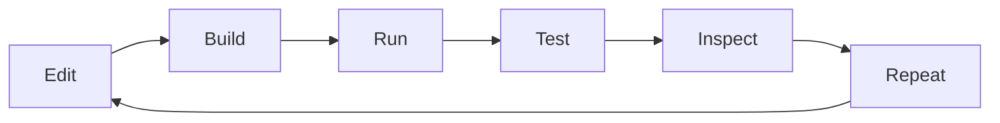

# AI-Assisted Development

This guide documents the MCC AI-assisted development workflow as a real working loop, not a patch generator running on guesses. The goal is to give the agent an environment it can drive on its own: build MCC, start a local server, send commands, inspect logs, and repeat. Once that loop is in place, iteration is faster and regressions are easier to catch.

If you are looking for the broader contributor entry point first, start with [Contributing](contibuting.md) and then come back here for the agent workflow.

The practical goal is a closed loop:



<div class="custom-container warning"><p class="custom-container-title">Warning</p>

If you develop on Windows, use WSL2. This workflow is built around Unix-style shells, `tmux`, `python3`, and shell helper functions. Do not try to run the full AI workflow from plain PowerShell or CMD.

</div>

## Index

-   [What This Workflow Covers](#what-this-workflow-covers)
-   [Setup](#setup)
-   [How The Harness Works](#how-the-harness-works)
-   [Repository Tools](#repository-tools)
-   [Skills](#skills)
-   [Standard Development Loop](#standard-development-loop)
-   [Testing And Validation](#testing-and-validation)
-   [Version Adaptation Notes](#version-adaptation-notes)
-   [Example Workflows](#example-workflows)

## What This Workflow Covers

This is the workflow for:

-   local MCC development
-   local offline server testing
-   AI-assisted debugging
-   bot authoring
-   protocol and version adaptation work
-   documentation work that should still follow the same disciplined loop

It is built around two layers:

-   repo tools in `tools/`, which do the actual work
-   AI skills in `.skills/`, which tell the agent when and how to use those tools

## Setup

You only do most of this once.

<details>
<summary><strong>Windows: install WSL2 first</strong></summary>

Open PowerShell as Administrator and run:

```powershell
wsl --install
```

If WSL is already enabled and you specifically want Ubuntu, use:

```powershell
wsl --install -d Ubuntu
```

If the install stalls at `0.0%`, use:

```powershell
wsl --install --web-download -d Ubuntu
```

Restart if Windows asks for it, then open the Ubuntu shell and finish the Linux user setup there.

From this point on, do MCC development inside WSL. That includes cloning the repo, building, running servers, and using AI agent tooling.

Reference: [Microsoft WSL installation guide](https://learn.microsoft.com/windows/wsl/install)

</details>

<details>
<summary><strong>Linux and macOS: use Bash or Zsh</strong></summary>

Bash and Zsh both work with MCC's helper scripts.

Check your current shell:

```bash
echo $SHELL
```

Notes:

-   Bash is the normal baseline on Linux.
-   Zsh is the default interactive shell on modern macOS.
-   The helper script `tools/mcc-env.sh` can be sourced from either `~/.bashrc` or `~/.zshrc`.

</details>

<details>
<summary><strong>Install Git</strong></summary>

Ubuntu, Debian, and derivatives:

```bash
sudo apt update
sudo apt install git
```

Arch Linux:

```bash
sudo pacman -S git
```

macOS with Homebrew:

```bash
brew install git
```

Verify:

```bash
git --version
```

Reference: [Git downloads](https://git-scm.com/downloads)

</details>

<details>
<summary><strong>Install .NET SDK 10</strong></summary>

MCC currently builds on `.NET 10`. You need the SDK, not just the runtime.

Supported Ubuntu releases and Ubuntu-based distros with the correct feed enabled:

```bash
sudo apt-get update && sudo apt-get install -y dotnet-sdk-10.0
```

Debian 12:

```bash
wget https://packages.microsoft.com/config/debian/12/packages-microsoft-prod.deb -O packages-microsoft-prod.deb
sudo dpkg -i packages-microsoft-prod.deb
rm packages-microsoft-prod.deb
sudo apt-get update && sudo apt-get install -y dotnet-sdk-10.0
```

Debian 13:

```bash
wget https://packages.microsoft.com/config/debian/13/packages-microsoft-prod.deb -O packages-microsoft-prod.deb
sudo dpkg -i packages-microsoft-prod.deb
rm packages-microsoft-prod.deb
sudo apt-get update && sudo apt-get install -y dotnet-sdk-10.0
```

Arch Linux:

```bash
sudo pacman -S dotnet-sdk
```

macOS with Homebrew:

```bash
brew install --cask dotnet-sdk
```

Verify:

```bash
dotnet --version
```

References:

-   [Install .NET on Ubuntu](https://learn.microsoft.com/dotnet/core/install/linux-ubuntu)
-   [Install .NET on Debian](https://learn.microsoft.com/dotnet/core/install/linux-debian)
-   [Homebrew `dotnet-sdk` cask](https://formulae.brew.sh/cask/dotnet-sdk)

</details>

<details>
<summary><strong>Install Java 21</strong></summary>

The local server harness uses `java` directly, so Java 21 needs to be on your `PATH`.

Ubuntu and Ubuntu-based distros:

```bash
sudo apt update
sudo apt install openjdk-21-jdk
```

Debian:

Package availability varies by Debian release. If `openjdk-21-jdk` is not available in your configured repositories, install a current JDK 21 build from your preferred vendor instead of forcing a stale package name.

Arch Linux:

```bash
sudo pacman -S jdk21-openjdk
```

macOS with Homebrew:

```bash
brew install openjdk@21
sudo ln -sfn "$(brew --prefix openjdk@21)/libexec/openjdk.jdk" /Library/Java/JavaVirtualMachines/openjdk-21.jdk
```

Homebrew marks `openjdk@21` as keg-only, which is why the symlink step matters.

Verify:

```bash
java -version
```

References:

-   [Ubuntu `openjdk-21-jdk` package](https://packages.ubuntu.com/noble/openjdk-21-jdk)
-   [Arch `jdk21-openjdk` package](https://archlinux.org/packages/extra/x86_64/jdk21-openjdk/)
-   [Homebrew `openjdk@21` formula](https://formulae.brew.sh/formula/openjdk@21)

</details>

<details>
<summary><strong>Install Python 3</strong></summary>

Python 3 is required for the RCON helper and the version-adaptation tools.

Ubuntu, Debian, and derivatives:

```bash
sudo apt update
sudo apt install python3
```

Arch Linux:

```bash
sudo pacman -S python
```

macOS with Homebrew:

```bash
brew install python@3.14
```

Homebrew currently provides Python 3 through the `python@3.14` formula, and aliases it as `python` and `python3`.

Verify:

```bash
python3 --version
```

References:

-   [Ubuntu `python3` package](https://packages.ubuntu.com/noble/python/python3)
-   [Arch `python` package](https://archlinux.org/packages/core/x86_64/python/)
-   [Homebrew Python formula](https://formulae.brew.sh/formula/python@3.14)

</details>

<details>
<summary><strong>Install tmux</strong></summary>

The local Minecraft server runs in a `tmux` session so it can keep running while the agent builds and restarts MCC.

Ubuntu, Debian, and derivatives:

```bash
sudo apt update
sudo apt install tmux
```

Arch Linux:

```bash
sudo pacman -S tmux
```

macOS with Homebrew:

```bash
brew install tmux
```

Verify:

```bash
tmux -V
```

</details>

<details>
<summary><strong>Clone the repo and initialize submodules</strong></summary>

Clone with submodules in one step:

```bash
git clone https://github.com/MCCTeam/Minecraft-Console-Client.git --recursive
```

If you already cloned it without submodules:

```bash
git submodule update --init --recursive
```

</details>

<details>
<summary><strong>Prepare a server version and decompiled source</strong></summary>

From the repo root, use the decompiler helper to download the official server jar and create the decompiled source tree:

```bash
tools/decompile.sh --version 1.20.6
```

That creates the paths used by the harness and the version-adaptation workflow:

-   `$MCC_SERVERS/1.20.6/server.jar`
-   `MinecraftOfficial/1.20.6-decompiled/`

If you are doing protocol work, this step is not optional.

</details>

<details>
<summary><strong>Load the MCC shell helpers in Bash</strong></summary>

Add this line to `~/.bashrc`:

```bash
source "$HOME/Minecraft/Minecraft-Console-Client/tools/mcc-env.sh"
```

Reload the shell:

```bash
source ~/.bashrc
```

This gives you the helper functions used by the workflow:

-   `mc-start`
-   `mc-stop`
-   `mc-cmd`
-   `mc-log`
-   `mc-rcon`
-   `mcc-build`
-   `mcc-run`
-   `mcc-cmd`
-   `mcc-kill`
-   `mcc-reload`

</details>

<details>
<summary><strong>Load the MCC shell helpers in Zsh</strong></summary>

Add this line to `~/.zshrc`:

```bash
source "$HOME/Minecraft/Minecraft-Console-Client/tools/mcc-env.sh"
```

Reload the shell:

```bash
source ~/.zshrc
```

If your clone lives somewhere else, update the path in the `source` line.

</details>

<details>
<summary><strong>Verify the environment</strong></summary>

Run these checks:

```bash
git --version
dotnet --version
java -version
python3 --version
tmux -V
```

Then make sure the helper functions are loaded:

```bash
type mc-start
type mcc-build
type mcc-run
```

</details>

## How The Harness Works

AI agents do not get a rich interactive terminal in the same way a human does. That is why this workflow uses a harness instead of relying on live keyboard input.

The moving parts are:

-   a local Minecraft server running in `tmux`
-   `mc-rcon` for server-side commands such as `/op`, `/give`, `/summon`, or gamerule setup
-   MCC started with `MCC_FILE_INPUT=1`
-   `FileInputBot`, which watches `mcc_input.txt` and turns file lines into MCC commands or server chat
-   logs from MCC and the local server, which the agent can inspect between runs

The result is simple: the agent can change code, rebuild, start the app, inject commands, and read the result without waiting for a human to sit in the terminal.

## Repository Tools

These are the repo-level tools that make the workflow practical.

| Path | Purpose |
| --- | --- |
| `tools/mcc-env.sh` | Loads the shell helper functions used for the normal loop. |
| `tools/start-server.sh` | Starts a local Minecraft server in a named `tmux` session with a FIFO for stdin. |
| `tools/mc-rcon.sh` | Sends RCON commands to the local server using `python3`. |
| `tools/decompile.sh` | Downloads `MinecraftDecompiler.jar` if needed, decompiles the requested Minecraft version, and fetches `server.jar` for server-side work. |
| `tools/diff_registries.py` | Compares registries between two Minecraft versions to show which palettes need updates. |
| `tools/gen_item_palette.py` | Generates item palette source from decompiled or reported registry data. |
| `tools/gen_block_palette.py` | Generates block palette source from authoritative block reports. |
| `tools/gen_entity_palette.py` | Generates entity palette source from registry reports. |
| `tools/gen_entity_metadata_palette.py` | Generates entity metadata palette source from serializer registration order. |
| `tools/gen_command_argument_registry.py` | Helps update modern declare-commands registry order. |
| `tools/gen_block_shapes.py` | Downloads and compacts collision shape data for physics support. |

There is one more piece worth calling out:

-   `MinecraftClient/ChatBots/FileInputBot.cs` is what makes file-driven command injection possible.
-   It is loaded when `MCC_FILE_INPUT=1` is set.
-   `mcc-run` in `tools/mcc-env.sh` already sets that flag for you.

## Skills

The tools above do the work. The skills in `.skills/` tell the AI when to use them and what good output looks like.

| Skill | What it is for | Notes |
| --- | --- | --- |
| `mcc-dev-workflow` | The default build, run, debug, and local server loop. | This is the skill to use for most day-to-day MCC debugging. It assumes WSL, `tmux`, Java, and the local harness. |
| `mcc-integration-testing` | Repeatable end-to-end testing against a local offline server. | This skill bundles its own scripts under `.skills/mcc-integration-testing/scripts/`. Those are skill resources, not top-level repo scripts. |
| `mcc-version-adaptation` | Protocol and palette updates for new Minecraft versions. | Use this when routing, registries, metadata, palettes, or structured components change. |
| `mcc-chatbot-authoring` | Authoring or repairing built-in bots and standalone `/script` bots. | This skill bundles references and templates under `.skills/mcc-chatbot-authoring/`. It defaults to standalone `/script` bots unless built-in wiring is requested. |
| `csharp-best-practices` | C# 14 / .NET 10 coding guidance for this repo. | Use it whenever the change touches MCC runtime code. |
| `humanizer` | Documentation and prose cleanup. | Use it for docs, guides, release notes, and anything that starts sounding machine-written. |
| `mcc-prompt-engineer` | Generating structured prompts for MCC development tasks. | Manually triggered. Interviews the user, explores the codebase, and produces a self-contained prompt with reasoning framework, skill references, and sub-agent directives. |
| `skill-creator` | Creating or evolving skills themselves. | This is for improving the AI workflow, not for normal MCC feature work. |

The important distinction is this:

-   repo tools are executable scripts and source files
-   skills are instructions, references, templates, and workflow constraints for the AI

Some skills also carry their own bundled resources:

-   `mcc-integration-testing` bundles scripts and a command matrix reference
-   `mcc-chatbot-authoring` bundles references and bot templates
-   `skill-creator` bundles scripts, eval tooling, and reviewer assets

## Standard Development Loop

This is the core loop you should expect an agent to follow.

### 1. Start the local server

```bash
mc-start 1.20.6
```

Check the recent server output:

```bash
mc-log 1.20.6
```

### 2. Build MCC

```bash
mcc-build
```

### 3. Run MCC with file input enabled

```bash
mcc-run
```

The raw form looks like this:

```bash
MCC_FILE_INPUT=1 dotnet run --project MinecraftClient -c Release -- CursorBot - localhost:25565
```

### 4. Set up server state through RCON

Examples:

```bash
mc-rcon "op CursorBot"
mc-rcon "gamerule sendCommandFeedback true"
mc-rcon "give CursorBot diamond_sword 1"
mc-rcon "summon minecraft:armor_stand ~ ~ ~"
```

### 5. Drive MCC through `mcc_input.txt`

Examples:

```bash
mcc-cmd "inventory player list"
mcc-cmd "entity"
mcc-cmd "/gamemode creative"
```

Behavior:

-   lines starting with `/` are sent as server commands or chat
-   lines without `/` are treated as MCC internal commands first
-   if a line is not an MCC internal command, it falls back to normal chat sending

### 6. Inspect the result

Read the MCC output and the server log, decide what changed, and either keep iterating or stop.

### 7. Rebuild and restart fast

```bash
mcc-reload
```

That is the usual tight loop for regression work.

## Testing And Validation

There are two main testing styles in this workflow.

### Manual validation

This is enough for smaller changes:

-   join the local server
-   grant operator privileges with `mc-rcon`
-   run internal MCC commands through `mcc-cmd`
-   trigger gameplay or server state changes through `mc-rcon`
-   inspect logs for parsing errors, disconnects, or wrong output

Typical manual checks:

-   inventory listing and creative item injection
-   entity tracking after `summon`
-   terrain and chunk handling after join
-   chat and command flow
-   explosion, particle, and sound events

### Scripted full-spectrum testing

The `mcc-integration-testing` skill goes further. It bundles its own scripts under `.skills/mcc-integration-testing/scripts/` and expects the shell helpers from `~/.zshrc`.

Treat those scripts as skill-owned resources. Read the skill before running them directly, and do not assume they behave like top-level repo tools.

That skill is designed for repeatable offline validation of:

-   chat
-   slash commands
-   MCC internal commands
-   inventory handling
-   entity handling
-   particles and sounds
-   TNT and explosion handling

Server settings that matter for AI-driven offline testing:

-   `eula=true`
-   `online-mode=false`
-   `enforce-secure-profile=false`
-   `enable-rcon=true`
-   `rcon.password=test123`

If those are wrong, the loop gets noisy fast.

## Version Adaptation Notes

Version work needs a stricter process than normal bug fixing.

The important rule is simple:

-   for newer versions, especially `1.21.9+`, use server data reports as the authority for items and blocks
-   use decompiled source for implementation details, field order, codecs, and serializer logic
-   do not stop at a palette diff; finish with a build and a live server test

The usual order is:

1. `tools/decompile.sh --version <ver>`
2. generate server reports from `server.jar`
3. run `tools/diff_registries.py`
4. regenerate the palettes that actually changed
5. update version routing and packet handling
6. build MCC
7. test against the real target version

That is exactly the sort of work `mcc-version-adaptation` is meant to guide.

## Example Workflows

These are four common patterns this guide is meant to support.

### Example 1: Debug a runtime regression

Use skills:

-   `mcc-dev-workflow`
-   `csharp-best-practices`

Typical loop:

```bash
mc-start 1.20.6
mcc-build
mcc-run
mc-rcon "op CursorBot"
mcc-cmd "inventory player list"
mcc-cmd "entity"
```

Then inspect the MCC output, patch the code, and use:

```bash
mcc-reload
```

### Example 2: Build or repair a bot

Use skills:

-   `mcc-chatbot-authoring`
-   `csharp-best-practices`
-   `mcc-dev-workflow`

Typical flow:

1. Decide whether this should be a standalone `/script` bot or a built-in bot.
2. Use the authoring skill's references and templates.
3. Build MCC.
4. Start a local server and join it.
5. Test the bot behavior through live commands, chat, or event-driven actions.
6. Make sure cleanup paths such as `OnUnload()` are correct.

For standalone script work, the skill defaults to `/script` unless built-in repo wiring is explicitly needed.

### Example 3: Adapt MCC to a new Minecraft version

Use skills:

-   `mcc-version-adaptation`
-   `mcc-dev-workflow`
-   `mcc-integration-testing`

Typical flow:

```bash
tools/decompile.sh --version 26.1
```

Generate server reports:

```bash
cd /tmp
java -DbundlerMainClass=net.minecraft.data.Main \
  -jar "$MCC_SERVERS/26.1/server.jar" \
  --reports --output /tmp/mc_reports
```

Run the registry diff:

```bash
python3 tools/diff_registries.py 1.21.10 26.1 --registry /tmp/mc_reports/reports/registries.json
```

Then regenerate the palettes that changed, update routing, build MCC, start a local server for the target version, and run live validation before calling the work done.

### Example 4: Write or update documentation for the workflow itself

Use skills:

-   `humanizer`
-   `skill-creator`, if you are changing the skills rather than just the docs

Typical flow:

1. Re-read the relevant skill files and repo tools.
2. Update the guide so the written process matches the real process.
3. Keep the instructions concrete enough that another contributor can follow them without guessing.
4. If the workflow itself changed, update the relevant skill too instead of leaving the docs ahead of the automation.
