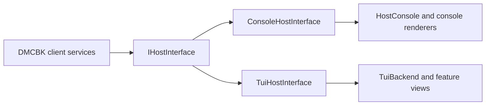

# MCC CLI implementation

This project is MCC's executable. It connects DMCBK's portable client services to the classic console and the Consolonia terminal UI. The [source architecture guide](../README.md) explains startup, dependencies, command flow, configuration, plugins, and shutdown, with diagrams.

## Entry points

- [Program.cs](Program.cs) calls `CliHost.RunAsync`, handles early tools, loads configuration, chooses the host adapters, builds the client, and attaches plugins and the marketplace.
- The classic host loop lives in `Program.cs`. It chooses rich input, plain input, or file input and sends lines through the DMCBK command service.
- [Tui/Hosting/TuiHost.cs](Tui/Hosting/TuiHost.cs) drives the client through the terminal UI. [TuiBackend.cs](Tui/Hosting/TuiBackend.cs) owns the UI thread and posts work to it.
- [Hosting/HostExit.cs](Hosting/HostExit.cs) and [HostControl.cs](Hosting/HostControl.cs) keep exit behavior consistent between the two hosts.

## Folder map

| Folder | Responsibility |
| --- | --- |
| `Startup/` | Arguments, help, application version, guided login, and idle startup |
| `Hosting/` | Application lifetime, shutdown, and shared host state |
| `Hosting/Classic/` | Console implementations of DMCBK authentication, output, UI, and resource-pack interfaces |
| `Configuration/` | Console settings, TOML overrides, and environment files |
| `Input/` | File-based command input |
| `Commands/` | MCC commands and navigation contracts |
| `Logging/` | Console logging, file logging, and filters |
| `Presentation/` | Chat, ANSI colors, glyphs, maps, status panels, and Markdown rendering |
| `BeaconTooling/` | One-shot Beacon run, lint, and format frontends |
| `Plugins/` | Installation prompts and plugin/marketplace validation frontends |
| `Diagnostics/` | Session reports, transcripts, packet capture, and smoke checks |
| `Localization/` | String helpers, resource files, and generated accessors |
| `Resources/` | Additional host text resources |
| `Tui/` | Terminal backend, host adapters, presentation, overlays, and feature views |

Tests live in [Mcc.Cli.Tests](../Mcc.Cli.Tests) and generally use matching feature folders. Shared fixtures live in `Fakes/`; Beacon tests live in `Beacon/`.

## Presentation adapters

MCC supplies the same DMCBK interface for both host modes. Each adapter chooses how to ask a question, show a result, or open a view.

Use `HostConsole` for classic output so terminal messages and line editing stay synchronized. In TUI code, post UI work through `TuiBackend`. Keep the protocol, dependency resolver, and Beacon interpreter in their owning library packages.

## Source and resource conventions

Feature folders use matching namespaces under `Mcc.Cli`. The enclosing `src` directory is a repository layout choice, so it is not part of the namespace. The SDK includes C# files recursively; moving a source file does not require a new compile entry in the project file.

Embedded-resource paths and logical names are explicit where needed, including the minimap data in [Mcc.Cli.csproj](Mcc.Cli.csproj). Keep those entries synchronized if you move a resource. Assembly names and resource identities remain `Mcc.Cli`.

Put user-visible text into the appropriate `.resx` file, then regenerate accessors with `tools/localization/generate_strings.py` from the repository root. Do not edit generated code. See the [translation guide](../../docs/contributing/translations.md) for keys, placeholders, and Crowdin.

For build commands and validation, read the [source architecture guide](../README.md#build-settings-and-tests) and [Windows helper guide](../../tools/windows/README.md).
