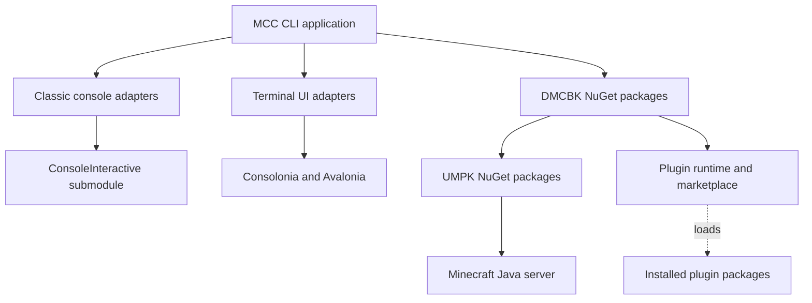
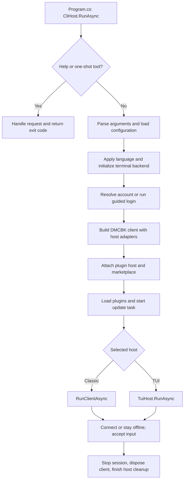
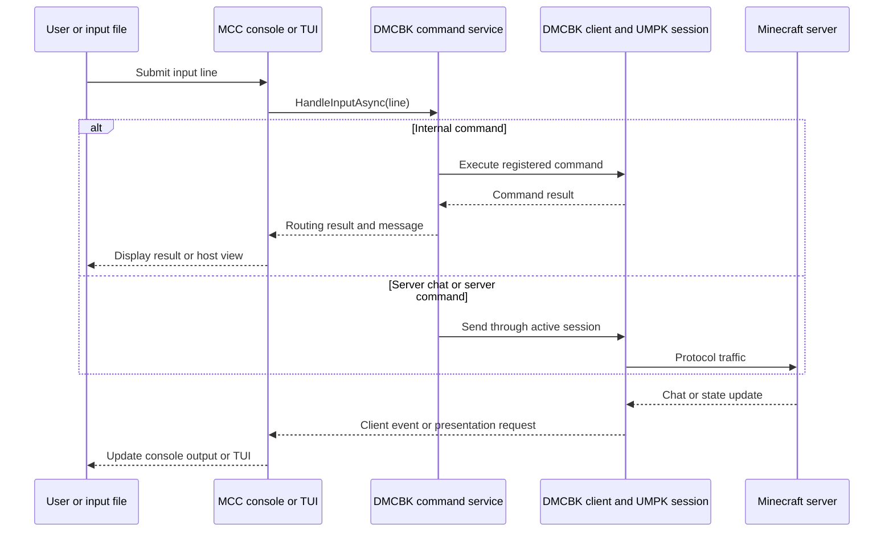

# MCC 2.0 source and architecture

MCC is the console and terminal UI application built on DMCBK. This directory contains the application, its tests, and their shared build settings. Start with [Mcc.Cli/Program.cs](Mcc.Cli/Program.cs) to follow startup, or use the folder map below to find a specific feature.

For installation and everyday use, read the [user documentation](../docs/index.md). This guide explains how the code fits together and where a change belongs.

## Directory layout

```text
src/
├── README.md
├── Directory.Build.props          # Framework, language, version, and build rules
├── Directory.Packages.props       # Central NuGet package versions
├── Mcc.Cli/
│   ├── Program.cs                 # Entry point and application composition
│   ├── Mcc.Cli.csproj
│   ├── Startup/
│   ├── Configuration/
│   ├── Hosting/
│   │   └── Classic/
│   ├── Input/
│   ├── Commands/
│   ├── Logging/
│   ├── Presentation/
│   ├── BeaconTooling/
│   ├── Plugins/
│   ├── Diagnostics/
│   ├── Localization/
│   ├── Resources/
│   └── Tui/
└── Mcc.Cli.Tests/                  # Host behavior and integration tests
```

The root [Mcc.slnx](../Mcc.slnx) includes both projects and the external ConsoleInteractive project. Moving these projects into `src` does not change their assembly names: they remain `Mcc.Cli` and `Mcc.Cli.Tests`. Feature namespaces continue to use `Mcc.Cli`, for example `Mcc.Cli.Presentation`.

## Application and library boundaries

MCC owns the terminal experience: startup arguments, login prompts, console settings, input, formatted output, TUI views, and process exit codes. DMCBK owns the reusable client services. UMPK provides the Minecraft protocol and game engine beneath those services.

The arrows in this diagram show dependencies and the connection to the server. The plugin box shows runtime loading rather than a project reference.



| Component | Responsibility | Where to make a change |
| --- | --- | --- |
| MCC | Terminal behavior, command presentation, application settings, menus, and startup | This repository, under `Mcc.Cli/` |
| DMCBK | Client lifetime, authentication orchestration, reconnect, commands, configuration, Beacon, plugin contracts, loading, and marketplace operations | [DMCBK repository](https://github.com/MCCTeam/DMCBK) |
| UMPK | Network protocol, version data, world and inventory models, physics, and pathfinding | [UMPK repository](https://github.com/MCCTeam/UMPK) |
| Official plugins | Individual automation features and integrations | [DMCBK-Plugins repository](https://github.com/MCCTeam/DMCBK-Plugins) |
| ConsoleInteractive | Classic line editing and suggestions | External submodule; do not edit its source here |

The application restores DMCBK and UMPK through NuGet. The CLI project has one source project dependency outside this directory: ConsoleInteractive. The test project references the CLI and uses the `DMCBK.Testing` package.

## Startup and composition

`Program.cs` calls `CliHost.RunAsync`. That method is the composition root: it creates the services and chooses the host adapters. The application uses explicit construction and `ClientBuilder`; there is no separate ASP.NET-style service container at startup.

Help, plugin validation, marketplace validation, and the Beacon command-line tools take an early path. They finish before normal client configuration and terminal startup. A Beacon `run` command can perform its own connection work when the script requests it; it does not enter the normal MCC input loop.

For a normal application session, startup follows these steps:

1. Parse positional arguments and dotted overrides. Resolve the configuration directory.
2. Load `.env` from that directory, then load `console.toml` for presentation settings.
3. Use DMCBK's configuration loader for client, account, and server settings. Apply the selected language before later prompts and plugin initialization.
4. Start the selected terminal backend. If no usable account exists, ask the user to configure one. Unattended runs fail with a clear error when an interactive answer is required.
5. Create logging and optional session diagnostics. Build the DMCBK client with the selected host interface, commands, Beacon, and configuration storage.
6. Create the plugin host and marketplace service. Attach both to the client, load installed plugins, and start the automatic-update task.
7. Enter the classic or TUI host. Connect when the settings request it; otherwise, keep the client at an offline prompt.



The builder enables portable client modules through `.UseCommands()` and `.UseBeacon()`. It receives an `IHostInterface` implemented by either `ConsoleHostInterface` or `TuiHostInterface`. These adapters provide authentication interaction, command output, resource-pack prompts, and host UI operations.

The plugin host and marketplace need the built client, the selected plugin root, and host confirmation callbacks. MCC creates them after `Build()` and registers them through `AttachModule`. Plugins therefore load before the first connection and can subscribe to session lifecycle events.

MCC identifies the application as `mcc` and supplies its application version. It also advertises the `aspnetcore` capability because the CLI references `Microsoft.AspNetCore.App` for plugins that host web endpoints. This framework reference does not turn MCC itself into a web server.

## Commands, chat, and incoming events

All three input paths use the DMCBK command service:

- The classic console uses ConsoleInteractive when rich input is available, or a plain console reader otherwise.
- The TUI uses its own prompt and completion views.
- `FileInputDriver` tails the file selected by `MCC_INPUT_FILE` when `MCC_FILE_INPUT=1`.

Each host sends the line to `client.Commands.HandleInputAsync`. The service decides whether the line is an internal command, server chat or command traffic, or input that needs a connection. MCC renders the resulting status and message.



MCC registers commands for host operations such as exit, console clearing, chat display, and menu navigation. TUI-specific map and minimap commands connect to their controllers. Portable game commands remain in DMCBK.

On the return path, MCC subscribes to client events and renders the data. Classic presentation code formats chat, status, maps, and manuals for terminal output. TUI code updates controls and overlays. Game snapshots and protocol parsing remain library responsibilities.

## Classic console and terminal UI

The classic host uses [Hosting/Classic](Mcc.Cli/Hosting/Classic) adapters and [Presentation](Mcc.Cli/Presentation) renderers. `HostConsole` routes output through the active writer so incoming messages do not disrupt ConsoleInteractive's input prompt or suggestions. Use it for classic application output rather than writing around it.

The TUI starts `TuiBackend` early enough to show the welcome text and authentication prompts inside its own screen. The backend runs the Consolonia application on a dedicated UI thread. UI work is posted through the backend; event callbacks must not edit controls directly from an arbitrary client thread.

The TUI separates presentation from feature views:

| TUI folder | Contents |
| --- | --- |
| `Hosting/` | Application, backend, main view, and host adapters |
| `Authentication/`, `Input/` | Login and connection dialogs, prompt, completion, and clipboard |
| `Presentation/`, `Terminal/` | Text, Markdown, status bars, terminal capabilities, and restoration |
| `Overlays/`, `Container/` | Books, dialogs, tab list, and inventory/container views |
| `Map/`, `Minimap/`, `Scoreboard/` | Live game-data views and their controllers |
| `Management/` | Account/server menus, scripts, recipes, entities, chunks, advancements, and manuals |
| `Plugins/` | Installed plugins, catalogues, versions, settings, updates, and confirmations |

Both hosts use the same client and marketplace APIs. A view can present a result differently, but it should not implement a second dependency resolver, protocol operation, or script interpreter.

## Configuration, localization, and storage

DMCBK loads `client.toml`, `accounts.toml`, and `servers.toml`. MCC owns `console.toml`, which selects the host and controls terminal presentation. MCC also loads `.env` so settings can refer to environment variables without putting secrets into ordinary configuration files.

The host supplies configuration storage and, when disk caching is selected, the authentication-token path. `MCC_PLUGINS` can select a plugin root; without that override, the application derives it from the configuration location. Keep runtime configuration, tokens, installed plugins, and user data outside the source directory.

MCC text belongs in its resource files:

- [Localization/Resources/MccStrings.resx](Mcc.Cli/Localization/Resources/MccStrings.resx) contains host strings used through the generated accessors and `Strings` helpers.
- [Resources/TextResources.resx](Mcc.Cli/Resources/TextResources.resx) contains additional CLI and TUI text.
- [Localization/Resources/ContainerArt.resx](Mcc.Cli/Localization/Resources/ContainerArt.resx) contains inventory artwork.

`UiCulture.Apply` sets the configured language before later initialization. MCC also sets the default thread cultures. Library resources remain in DMCBK and plugin resources remain with the plugins. Crowdin's paths are configured in [crowdin.yml](../crowdin.yml); read the [translation guide](../docs/contributing/translations.md) before changing resources.

Regenerate string accessors after a resource change:

```bash
python3 tools/localization/generate_strings.py
python3 tools/localization/generate_strings.py --check
```

Run these commands from the repository root. Do not edit generated accessors by hand.

## Beacon and plugins

`BeaconTooling/` handles MCC's one-shot `run`, `lint`, and `format` commands. It parses options, reads script input, invokes the DMCBK Beacon APIs, and maps results to output and exit codes. Scripts use `.bcn`. The TUI's script manager, editor, and REPL live in `Tui/Management/` and use the same library runtime.

`Plugins/` supplies install confirmations and validation frontends. `Tui/Plugins/` contains the plugin manager pages. DMCBK owns source compilation, assembly loading, lifecycle, dependency resolution, platform selection, immutable installations, locks, and rollback. Official plugin implementations are maintained separately.

For plugin changes, start with the [plugin architecture and development guides](../docs/plugins/development/index.md). For catalogue changes, read the [marketplace guides](../docs/marketplaces/index.md). UI code should display the plan returned by the marketplace service and apply it through that service.

## Session lifetime and shutdown

The client can exist without an active server session. This allows saved-server management, plugin operations, and reconnect commands at the offline prompt. A reconnect creates a new session while keeping the application and its attached modules alive.

`HostControl` records exit requests and whether the session ended remotely. `HostExit` applies the same exit rules to both hosts. The normal client path uses these codes:

| Code | Meaning |
| --- | --- |
| `0` | Clean exit |
| `1` | Invalid arguments or unusable configuration |
| `2` | Server version could not be resolved |
| `3` | Connection failed or ended remotely without a successful reconnect |
| `4` | Authentication or login was rejected |

An explicit `exit <code>` takes precedence. One-shot tools have their own result rules, documented with their commands.

The interactive classic prompt can survive a remote disconnect so the user can reconnect. File-driven operation watches for remote session termination as well as input and exit requests. Shutdown stops the active client session and disposes the client and attached modules. The outer cleanup also cancels and awaits automatic updates, removes the crash handler, and finishes any diagnostics bundle.

When adding event subscriptions, UI controllers, timers, or background tasks, give them an owner and a cleanup path. Client events can arrive on different threads. Use cancellation for background work and the TUI backend's posting API for UI updates.

## Logging and diagnostics

`Logging/` implements the host logger, configured filtering, and file output. Bootstrap logging is available during configuration loading; the full logger is created after client settings are known. In TUI mode, its output goes through the backend instead of the raw terminal.

`Diagnostics/` provides optional session transcripts, packet capture, environment/client/server reports, crash records, and the scripted smoke exercise. Diagnostics output is runtime data. It does not belong under `src` or in Git. Read the [diagnostics guide](../docs/troubleshooting/diagnostics.md) before sharing a bundle.

## Build settings and tests

[Directory.Build.props](Directory.Build.props) selects .NET 10, nullable references, deterministic builds, warnings as errors, and the MCC application version. It imports the root build settings so `MCC_BUILD_ROOT` can route intermediate and output files outside the checkout.

[Directory.Packages.props](Directory.Packages.props) pins the package graph for both projects. DMCBK is currently `0.1.0-preview.5`; UMPK is `0.9.0-beta.6`. Update package versions there instead of putting versions into individual project references.

The CLI also references `Microsoft.AspNetCore.App`, Consolonia, and the terminal/Markdown packages. These are application dependencies. Keep them out of the reusable DMCBK library boundary. Publish with accessible managed assemblies because source plugin compilation needs reference assets; the current helper sets `PublishSingleFile=false`.

Tests in [Mcc.Cli.Tests](Mcc.Cli.Tests) follow the host's feature groups, with shared fixtures in `Fakes/` and Beacon coverage in `Beacon/`. They cover argument routing, lifecycle and exit behavior, configuration, localization, rendering, diagnostics, Beacon, and TUI helpers. They do not replace manual terminal checks or live-server validation for changes to server behavior.

From the repository root:

```bash
git submodule update --init ConsoleInteractive
source tools/mcc-env.sh
mcc-build
mcc-test
mcc-run --help
python3 tools/localization/generate_strings.py --check
python3 tools/check_docs.py
```

On native Windows, use the matching [PowerShell helpers](../tools/windows/README.md). Use [the contribution guide](../docs/contributing/index.md) for the complete validation workflow and [AGENTS.md](../AGENTS.md) for repository rules.

## Where to start a change

| Change | Start here |
| --- | --- |
| Add a startup argument or change help | `Mcc.Cli/Startup/`, then composition in `Program.cs` |
| Add a console preference | `Mcc.Cli/Configuration/`, the relevant renderer, and configuration tests |
| Change chat, ANSI, or manual rendering | `Mcc.Cli/Presentation/` or `Mcc.Cli/Tui/Presentation/` |
| Add a host command | `Mcc.Cli/Commands/` or `Mcc.Cli/Tui/Commands/`, then the host registration point |
| Add a TUI feature view | Its feature folder under `Mcc.Cli/Tui/`, using library data and operations |
| Change Beacon CLI options | `Mcc.Cli/BeaconTooling/`; language/runtime changes belong in DMCBK |
| Change plugin manager screens | `Mcc.Cli/Tui/Plugins/`; loading/resolution changes belong in DMCBK |
| Add or change user-visible text | MCC resource files, generated accessors, and localization tests |
| Change protocol support or game behavior | UMPK or DMCBK, then consume a new package version here |
